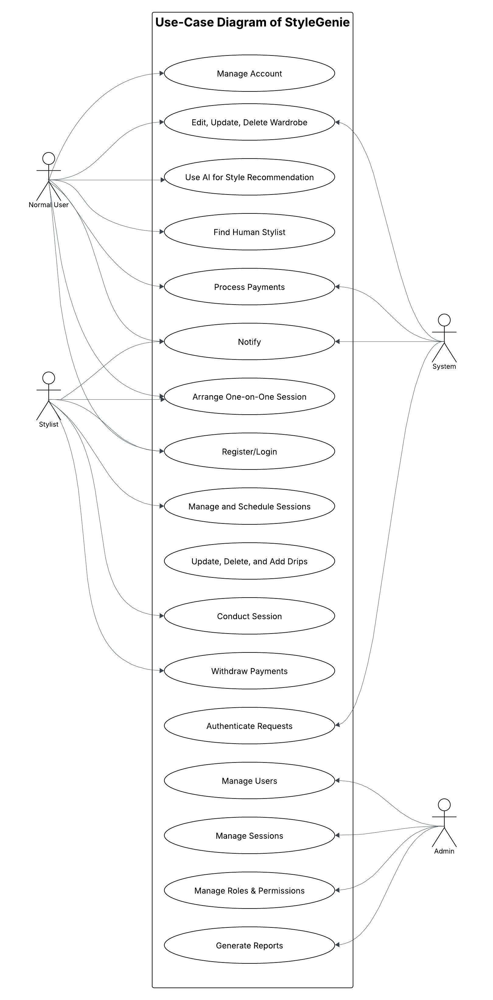
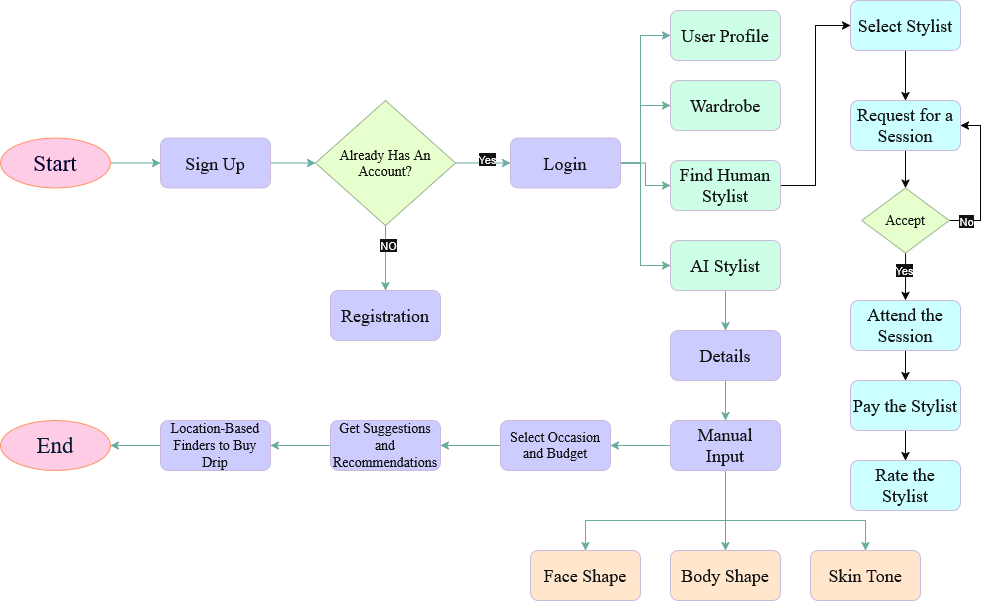
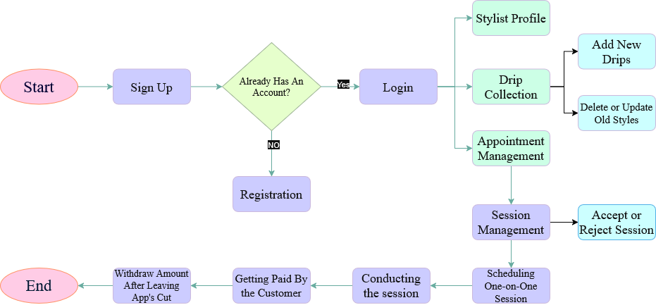
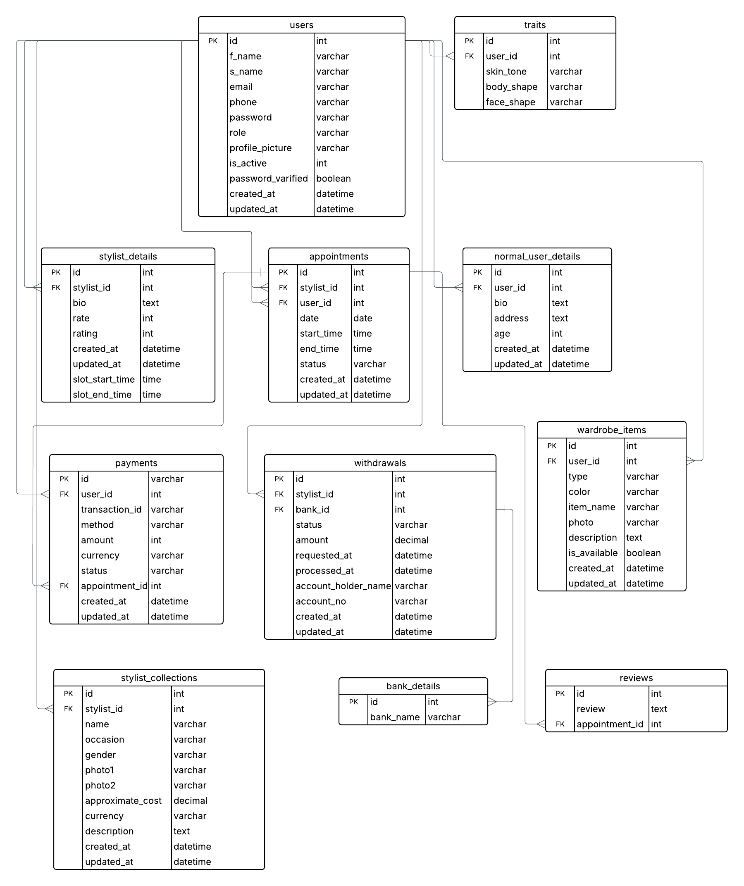

# 🧞‍♀️ StyleGenie – Your Smart Personal Stylist

StyleGenie is a web-based AI-powered styling assistant that helps users find the perfect outfit combinations based on their body type, face shape, skin tone, occasion, budget, and wardrobe. It also connects users with professional human stylists for personalized fashion guidance and lets stylists monetize their expertise directly on the platform.

---

## 📌 Project Context

In developing countries and fashion-conscious communities, many individuals face challenges in getting access to affordable, personalized fashion advice. Trained stylists are often inaccessible, and online tools rarely provide localized or budget-sensitive outfit recommendations.

**StyleGenie** solves these problems by combining manual user input with AI-generated outfit suggestions, wardrobe tracking, and one-on-one professional stylist sessions — all in one platform. The system bridges the gap between AI convenience and human creativity, making fashion both accessible and affordable.

---

## ✨ Key Features by Role

### 👤 **Normal Users**
- Create an account and maintain a style profile.
- Manually select their body shape, face shape, and skin tone.
- Add wardrobe items and manage their closet.
- Get "drip" suggestions based on wardrobe + traits + occasion.
- Choose a budget and receive AI-generated outfit recommendations.
- Browse stylist profiles and fix one-on-one style sessions.
- Make payments through the system after a successful session.

---

### 👗 **Stylists**
- Register and create a profile showcasing expertise.
- Set their session rates.
- Upload curated outfit collections ("drip check").
- Accept or reject styling session requests.
- Get paid through the system after providing services.

---

### 🛡️ **Admin**
- Monitor platform activity, including users, stylists, sessions, and payments.
- Create, edit, or delete users or stylists.
- View and resolve system or user-reported issues.
- Manage categories, settings, and platform policies.

---
## UML Diagram

### Use Case Diagram
  The main actors in our system are:
- **Regular Users** - Gets Style Suggestions and Fixes Appointments with Stylists.
- **Stylists** - Accepts and Conducts One-on-One Appointments with Regular Users.
- **System Admin** - Manages users and monitors system activities.

   
  
 <b>Use case diagram of our system</b>

### Activity Diagram

#### Activity Flow for Regular Users

    
     
    <b>Activity Diagram for Regular Users</b>

##### Activity Flow for Stylist

    
     
    <b>Activity Diagram for Stylists</b>

### Class Diagram

#### Key Classes:
1. **Users** (Base class for Regular Users, Stylists, and Admin).
2. **NormalUserDetails** (Send the style suggestion and appointment request)
3. **StylistDetails** (Accepts or rejects, and conducts appointment requests)
4. **Admin** (Manages the system)
5. **Appointments** (Represents an Appointment to be conducted).
6. **Payment** (Handles transactions for confirming an appointment).
7. **WardrobeItems** (Stores Regular Users' Personal Drip Collection).
8. **Review** (Handles user ratings and feedback).

### Entity-Relationship Database Diagram

    
     
  <b>Initial ERD of the system</b>

The Entity-Relationship (ER) diagram above visually represents the database schema and relationships between tables.

---

## 🧠 Tech Stack

- **Frontend**: React.js  
- **Backend**: Spring Boot (Java)  
- **Database**: PostgreSQL  
- **Styling Engine / AI**: Python / Spring AI (for outfit recommendation logic)  
- **Map Integration**: Mapbox (for location-based store suggestions)  
- **Payment Gateway**: Stripe / Razorpay (planned)

## 🚧 Status

- 🔄 Project is currently under development.  
- 🔒 AI model is integrated only for final outfit recommendations (not for trait detection).  
- 📲 One-on-one sessions and payment workflows are being prototyped.

---

> “Style isn’t about trends — it’s about confidence. Let StyleGenie help you wear yours.”

